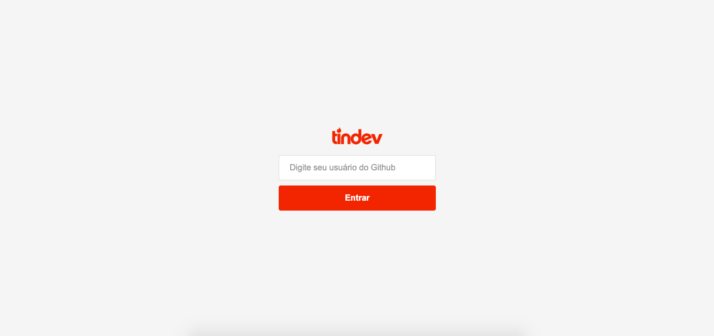

# Tindev

## Projeto da semana OmniStack #8 / Rocketseat
Consiste no desenvolvimento de uma aplicação completa com backend, web e mobile. O objetivo do projeto seria usar apenas uma linguagem de programação para desenvolver toda a aplicação, por isso a escolha do Node.JS, ReactJS e React-Native.

## Funcionalidade

A aplicação utiliza o mesmo conceito do aplicativo Tinder mas voltada para desenvolvedores usando os seus perfis do github.

Usuários que achem o perfil de outro desenvolvedor interessante para fazer parcerias, poderão curtir uns aos outros, caso a curtida seja mútua o sistema identifica que deu match e por websockets notifica as aplicações, tanto web quanto mobile em tempo real.

## Web

## Mobile

